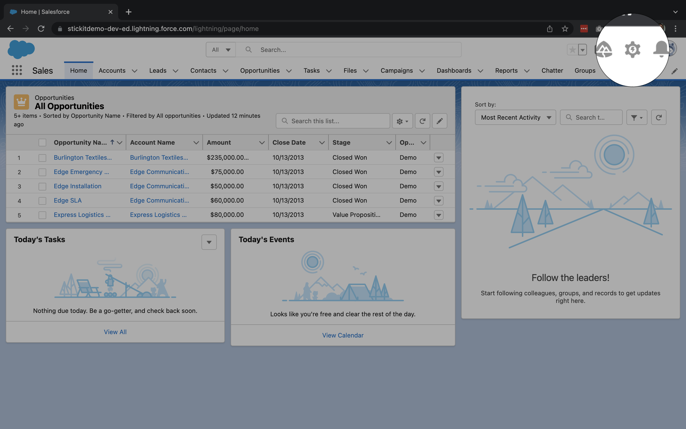
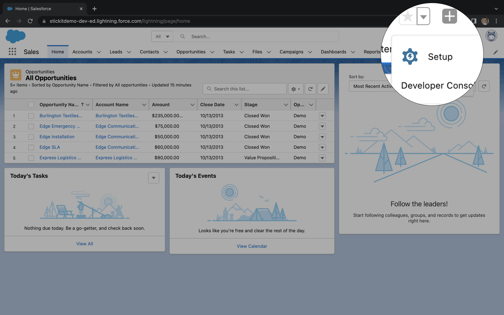
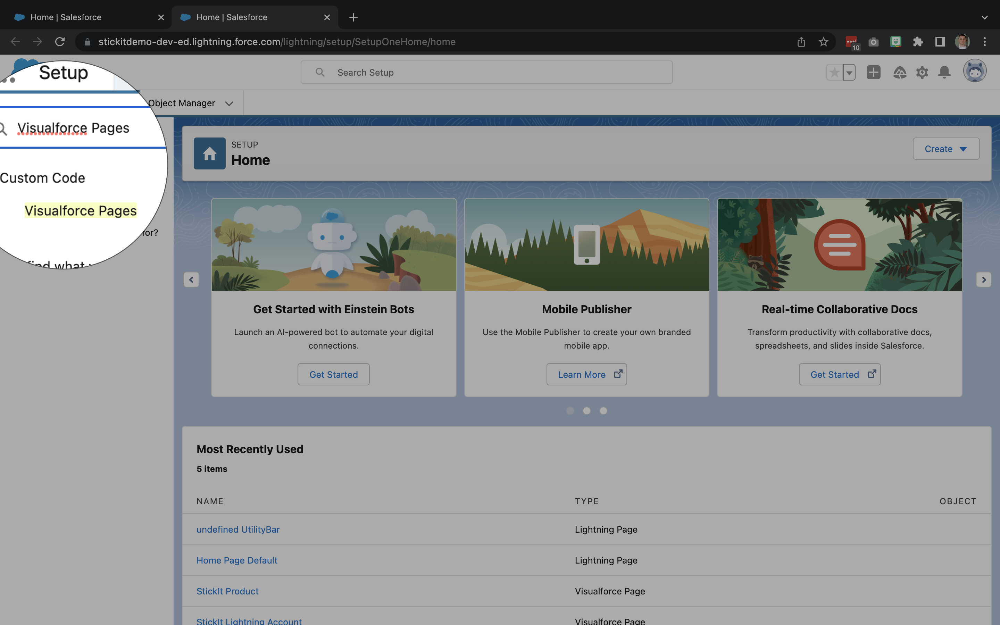
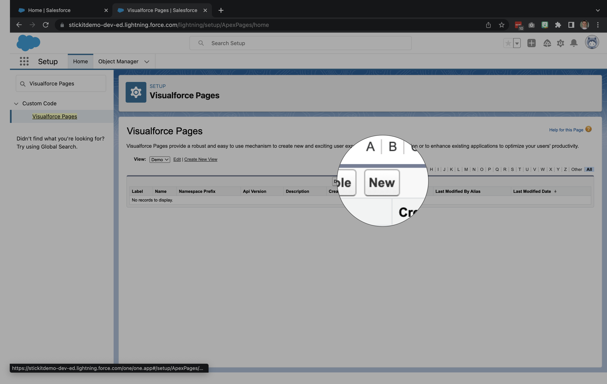
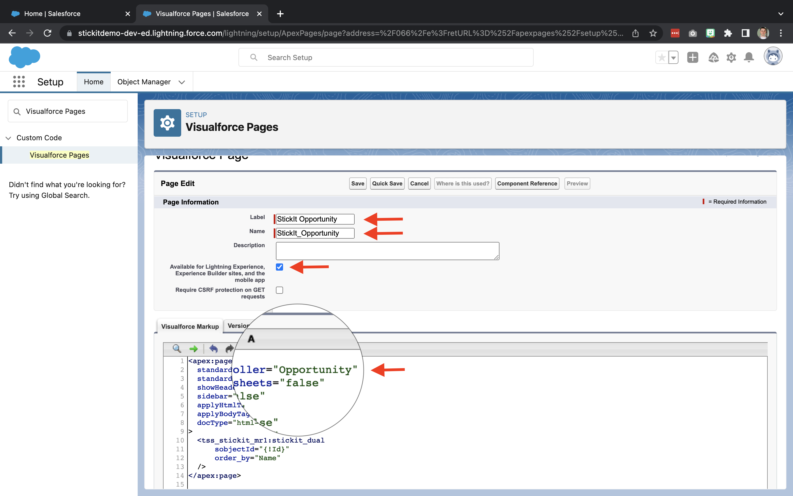

# Objects

Enable StickIt for use with any Standard or Custom Object by following these steps:

1. Click the **gear** icon in the upper right corner

1. Select **Setup** from the menu

1. Type "Visualforce Pages" into the `Quick Find` box and then select **Visualforce Pages**

1. Click the **New** button

1. Complete the following fields:
  - **Label**
  - **Name** _Make sure spaces are replaced with underscores_
  - **Available for Lightning Experience**...
  - **Visualforce Markup**


### Markup Template

```
<apex:page
  standardController="OBJECT_API_NAME" 
  standardStylesheets="false" 
  showHeader="false" 
  sidebar="false" 
  applyHtmlTag="false" 
  applyBodyTag="false" 
  docType="html-5.0"
>
  <tss_stickit_mr1:stickit_dual 
      sobjectId="{!Id}" 
      order_by="Name"
  />
</apex:page>
```
